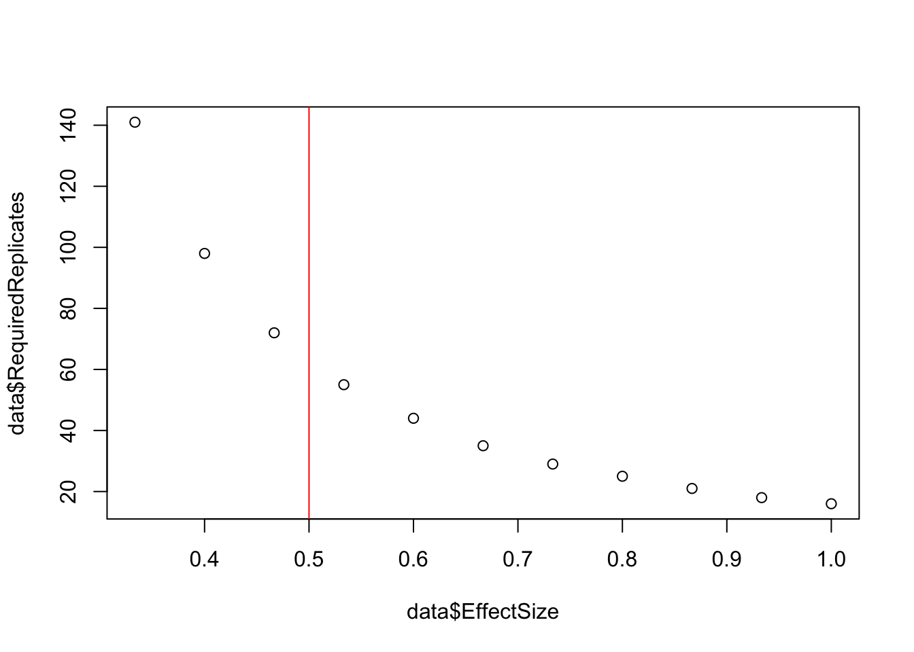
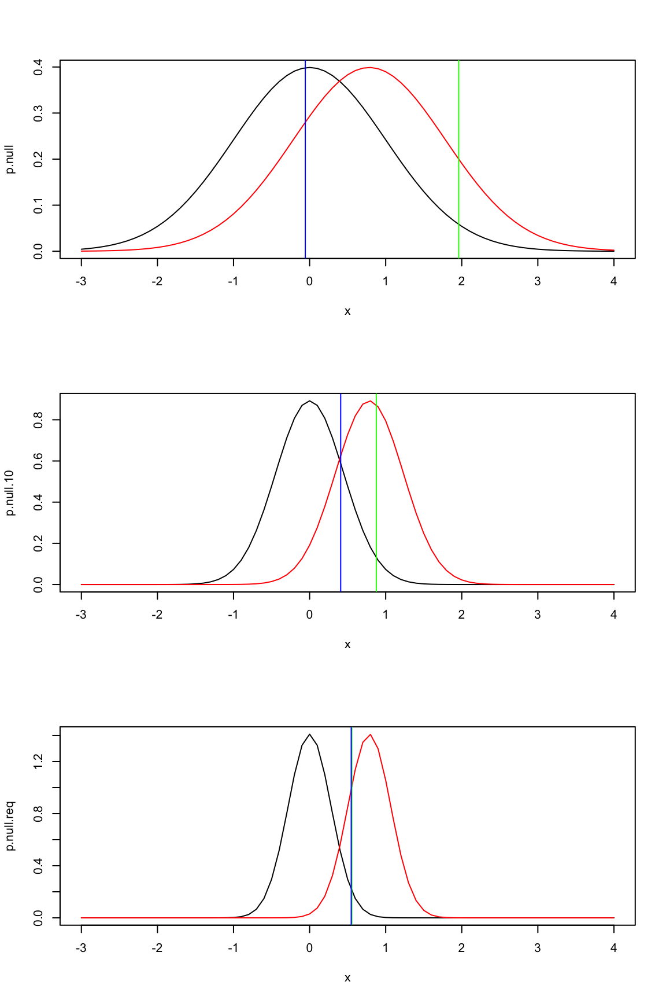
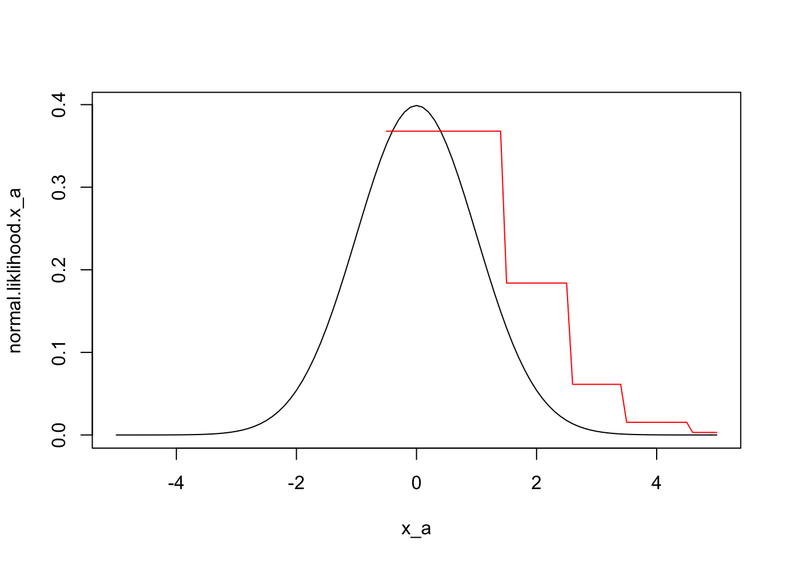
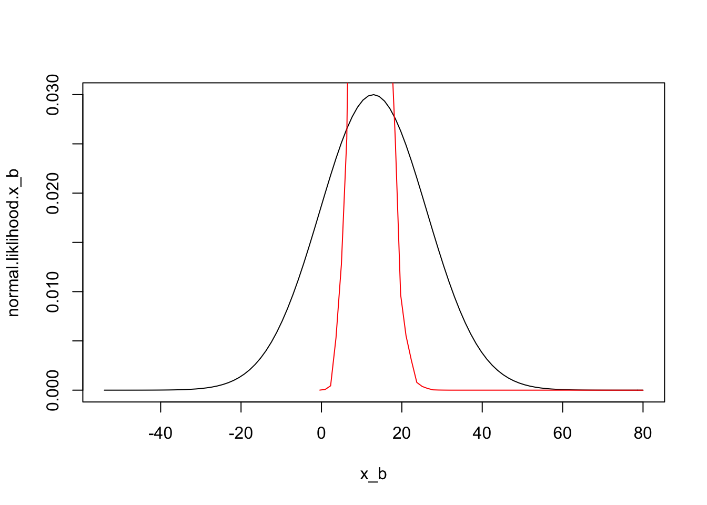
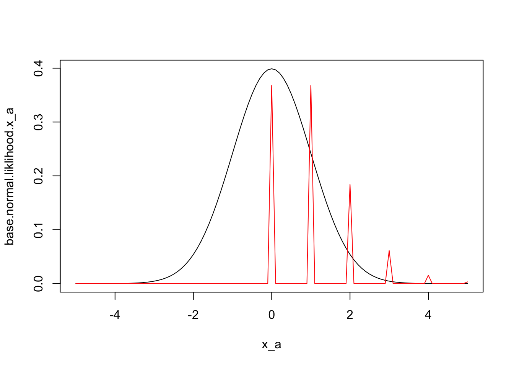
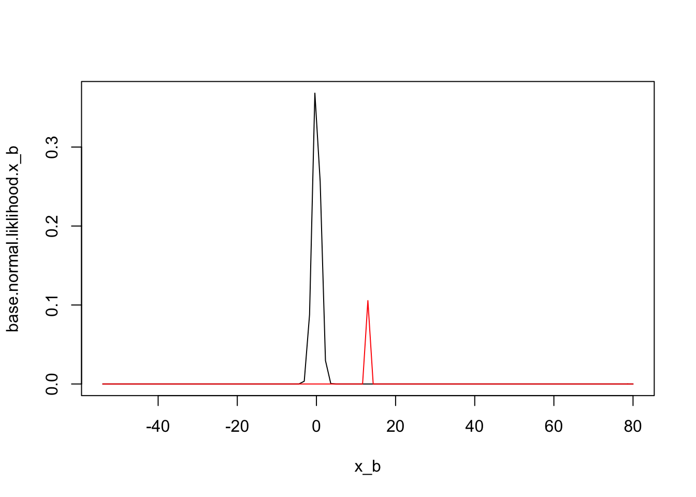
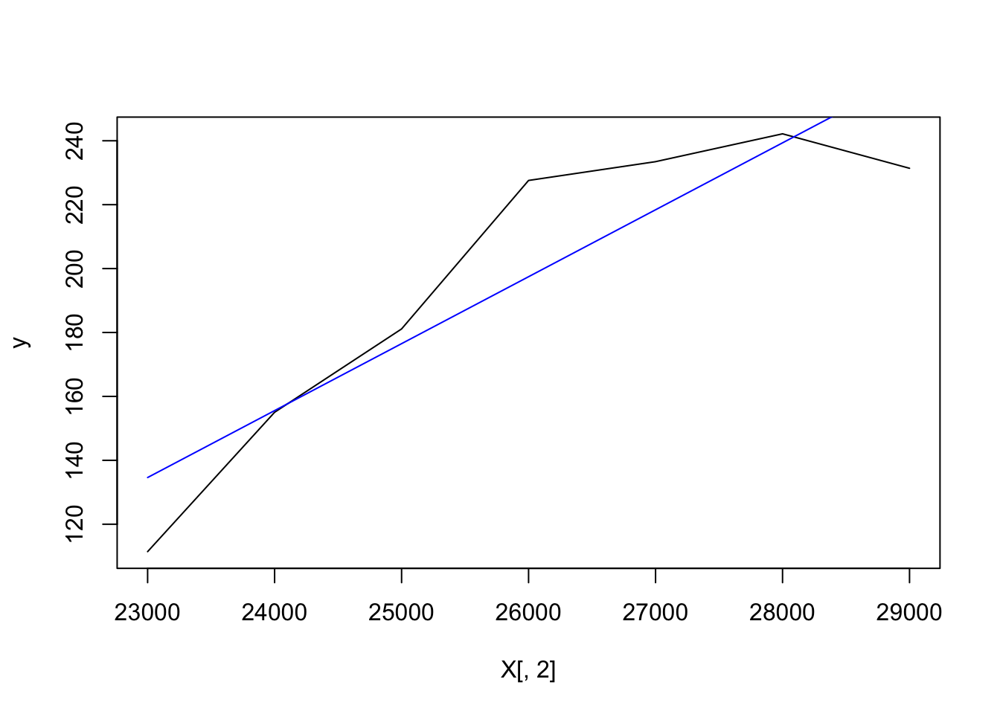

<script type="text/javascript" src="https://cdnjs.cloudflare.com/ajax/libs/mathjax/2.7.1/MathJax.js?config=TeX-AMS-MML_HTMLorMML">
</script>


# Instructions

There are six exercises below. You are required to provide solutions for at least four of the five. You are required to solve at least one exercise in R, and at least one in SAS. You are required to provide five solutions, each solution will be worth 10 points. Thus, you may choose to provide both R and SAS solutions for a single exercise, or you may solve all five problems, mixing the languages as you wish. The first four exercise refer to formula from the previous homework, you may reuse code as you wish.

#### Experimental

Again, you will be allowed to provide one solution using Python. Elaborate on the similarities and differences between Python arrays vs R or IML.

# Exercise 1.

### Part a.

We will calculate a number of required replicates for a range of mean differences, comparable to calories per serving estimates found in Wansink, Table 1.

Let $m_1$ be a sequence of means from 320-420, incremented by 10. Let $m_2$ be 270. Assume a pooled standard deviation of 150. 

Calculate Cohen's $d$ for the pairs of means ${320 - 270, 330 - 270, ...., 420 - 270}$, letting $s_i = s_j = s_{pooled}$. Calculate the required replicates for these same pairs of means. You may reuse code or functions from previous homework at your discretion.

To show your results, either create and print a matrix with one colum for effect size and one column for replicates, or plot required replicates versus effect size (effect size will be the independent variable). What does this tell you about the number of observations required to detect medium-size effects? You may include reference lines in your plot to illustrate.

Since we know that $s_{pooled} = \sqrt{(s_1^2 + s_2^2)/2}$

```r
# Creating a function with constant m2, pooled sd, alpha and beta.
combined <- function (m1,m2 = 270, s_pooled = 150, alpha = 0.05, beta = 0.2){
  cv <- (s_pooled)/((m1+m2)/2)
  percent.diff <- ((m1-m2)/((m1+m2)/2))
  cohens_d <-(abs(m1-m2)/(s_pooled))
  n <- 2*(((cv/percent.diff)^2)*(qnorm((1-alpha/2)) + qnorm((1-beta)))^2) 
  n <- round(n,0)
  value <- (list(CV = cv, PercentDiff= percent.diff, RequiredReplicates = round(n,0), EffectSize = cohens_d))
  return(value)
  }


m1 <- seq(320,420,10)
m1
```

```
##  [1] 320 330 340 350 360 370 380 390 400 410 420
```

```r
data <- combined(m1 = m1)
# cal.lm <- lm(data$RequiredReplicates ~ data$EffectSize)
# or even quadratic term
# cal.lm <- lm(data$RequiredReplicates ~ poly(data$EffectSize, 3, raw = TRUE))
plot(data$EffectSize, data$RequiredReplicates)
# abline(cal.lm)
# As per rule of thumb for medium-size effect, we can choose v= 0.5 as medium-size effects
# http://staff.bath.ac.uk/pssiw/stats2/page2/page14/page14.html
# Also, http://staff.bath.ac.uk/pssiw/stats2/page2/page14/page14.html
abline(v = 0.5, col= 'red')
```



Note: Cohen suggested that d = 0.2 be considered a 'small' effect size, 0.5 represents a 'medium' effect size and 0.8 a 'large' effect size. This means that if two groups' means don't differ by 0.2 standard deviations or more, the difference is trivial, even if it is statistically signficant. This plot tells us that with the increasing effect-size, we need fewer replicates. Since effect-size of |0.5| or (v= 0.5) is intersects with the abline at approximately 78 replicates in the plot, it also tells us that for medium-size effect we need about 78 replicates. 

# Exercise 2

Create a table to show the required replicates for a range of combinations of $\%Diff$ and $CV$. Do this in steps as follows:

### Part a.
Define two matrices, one for `CV` and one for `Diff`. Each will matrix will be 5 rows by 6 columns. Let the rows in CV be the sequence $8, 12, ..., 28$ and let the columns of `Diff` be the squence $5,10, ... , 25$. The matrices should look like:

$$
\begin{aligned} 
 CV & = \left\{
 \begin{array}{cccccc}
     8 & 12 & 16 & 20 & 24 & 28  \\
     8 & 12 & 16 & 20 & 24 & 28  \\
     \vdots & \vdots & \vdots & \vdots & \vdots  & \vdots \\
     8 & 12 & 16 & 20 & 24 & 28  \\
   \end{array}
   \right\} \\
   & \\
 \%Diff & = \left\{
 \begin{array}{ccccc}
     5 & 5 & 5 & 5 & 5  \\
     10 & 10 & 10 & 10 & 10 \\
     \vdots & \vdots & \vdots & \vdots & \vdots \\
     25 & 25 & 25 & 25 & 25 \\
   \end{array}
   \right\}
\end{aligned} 
$$

Define and print your matrices in the code below.


```r
# create sequence data and then matrix for CV
rep.cv <- rep(seq(8,28,4),5)
rep.cv
```

```
##  [1]  8 12 16 20 24 28  8 12 16 20 24 28  8 12 16 20 24 28  8 12 16 20 24
## [24] 28  8 12 16 20 24 28
```

```r
cv <- matrix(rep.cv, nrow = 5, ncol = 6, byrow = TRUE)
cv
```

```
##      [,1] [,2] [,3] [,4] [,5] [,6]
## [1,]    8   12   16   20   24   28
## [2,]    8   12   16   20   24   28
## [3,]    8   12   16   20   24   28
## [4,]    8   12   16   20   24   28
## [5,]    8   12   16   20   24   28
```

```r
# create sequence data and then matrix for %Diff
rep.Diff <- rep(seq(5,25,5), 6)
rep.Diff
```

```
##  [1]  5 10 15 20 25  5 10 15 20 25  5 10 15 20 25  5 10 15 20 25  5 10 15
## [24] 20 25  5 10 15 20 25
```

```r
Diff <- matrix(rep.Diff, nrow = 5, ncol = 6, byrow = FALSE)
Diff
```

```
##      [,1] [,2] [,3] [,4] [,5] [,6]
## [1,]    5    5    5    5    5    5
## [2,]   10   10   10   10   10   10
## [3,]   15   15   15   15   15   15
## [4,]   20   20   20   20   20   20
## [5,]   25   25   25   25   25   25
```

### Part b.

Calculate require replicates for each combination of `CV` and `Diff`. Use the same values for $z_\alpha$ and $z_\beta$ as from Homework 2 and 3. You should be able to reuse coce from previous exercises, and you should not use iteration.

Print the result below. The result should be a $5 \times 6$ matrix.


```r
# Now vectorize the matrices CV and %Diff from above
cv.vector <- as.vector(cv) 
cv.vector
```

```
##  [1]  8  8  8  8  8 12 12 12 12 12 16 16 16 16 16 20 20 20 20 20 24 24 24
## [24] 24 24 28 28 28 28 28
```

```r
Diff.vector <- as.vector(Diff)
Diff.vector
```

```
##  [1]  5 10 15 20 25  5 10 15 20 25  5 10 15 20 25  5 10 15 20 25  5 10 15
## [24] 20 25  5 10 15 20 25
```

```r
# We can then use the function in exercise 1 by slightly modifying it as:
combined <- function (cv, percent.diff, alpha = 0.05, beta = 0.2){
  cv <- cv
  percent.diff <- percent.diff
  n <- 2*(((cv/percent.diff)^2)*(qnorm((1-alpha/2)) + qnorm((1-beta)))^2) 
  n <- round(n,0)
  value <- list(CV = cv, PercentDiff= percent.diff, RequiredReplicates = round(n,0))
  return(value)
}
value <- combined(cv = cv.vector, percent.diff = Diff.vector)

RequiredReplicates <- matrix(value$RequiredReplicates, nrow = 5, ncol = 6, byrow = FALSE)
RequiredReplicates
```

```
##      [,1] [,2] [,3] [,4] [,5] [,6]
## [1,]   40   90  161  251  362  492
## [2,]   10   23   40   63   90  123
## [3,]    4   10   18   28   40   55
## [4,]    3    6   10   16   23   31
## [5,]    2    4    6   10   14   20
```

To check your work, repeat the calculations using the rule of thumb from the previous exercises. What is largest deviation of the rule of thumb from the exact calculation?

For this, first we can simplify the equations as follows:
first for CV,

$CV = \frac{sd_{pooled}}{(m_1 + m_2)/2}$
$(m_1 + m_2)/2) = \frac{sd_{pooled}}{CV/2}$
$(m_1 + m_2)/2) = {2} \times\frac{sd_{pooled}}{CV}$

then, for $\%diff$: 

$\%Diff = \frac{m_1 - m_2}{(m_1 + m_2)/2}$
$\%Diff\times\frac{(m_1 + m_2)}{2} = m_1-m_2$
$m_1-m_2 = \frac{\%Diff}{2}\times(m_1 + m_2)$

Now, if we replace $m_1 + m_2$, we get:
$m_1-m_2 = \frac{\%Diff}{2}\times ({2} \times\frac{sd_{pooled}}{CV})$

Or, $m_1-m_2 = \frac{{\%Diff } \ \times\ {sd_{pooled}}}{CV}$

This will give us delta ($\triangle$): 
$\triangle = \frac{m_1-m_2}{sd_{pooled}} = \frac{1}{sd_{pooled}} \times \frac{{\%Diff } \ \times\ {sd_{pooled}}}{CV} = \frac{\%Diff}{CV}$

Now we can use, rule of thumb as:
$n = \frac{16}{\triangle^2}$


```r
# As stated in rule of thumb: http://www.nrcse.washington.edu/research/struts/chapter2.pdf
# We can then use the simplified equation
rule.of.thumb.n <- function (cv, percent.diff){
  cv <- cv
  percent.diff <- percent.diff
  delta <- percent.diff/cv
  n <- (16/(delta^2))
  value <- list(CV = cv, PercentDiff= percent.diff, RequiredReplicates = round(n,0))
  return(value)
}

value <- rule.of.thumb.n(cv= cv.vector, percent.diff = Diff.vector)
Rule.of.Thumb.matrix <- matrix(value$RequiredReplicates, nrow = 5, ncol = 6, byrow = FALSE)
colnames(Rule.of.Thumb.matrix) <- paste0("CV",unique(value$CV))
rownames(Rule.of.Thumb.matrix) <- paste0("Diff",unique(value$PercentDiff))
# This matrix gives you the combination of all pairs of CV and %Diff for rule of thumb
Rule.of.Thumb.matrix
```

```
##        CV8 CV12 CV16 CV20 CV24 CV28
## Diff5   41   92  164  256  369  502
## Diff10  10   23   41   64   92  125
## Diff15   5   10   18   28   41   56
## Diff20   3    6   10   16   23   31
## Diff25   2    4    7   10   15   20
```

```r
# We can then compare the matrix from exact calculation and required replicates
# calculated using rule of thumb method by calculating the percent difference of
# two data matrices
percent_difference_between_two_df <- data.frame((abs(RequiredReplicates-Rule.of.Thumb.matrix)/(abs(RequiredReplicates+Rule.of.Thumb.matrix)/2))*100)
percent_difference_between_two_df
```

```
##                   CV8         CV12           CV16          CV20
## Diff5   2.46913580247 2.1978021978  1.84615384615 1.97238658777
## Diff10  0.00000000000 0.0000000000  2.46913580247 1.57480314961
## Diff15 22.22222222222 0.0000000000  0.00000000000 0.00000000000
## Diff20  0.00000000000 0.0000000000  0.00000000000 0.00000000000
## Diff25  0.00000000000 0.0000000000 15.38461538462 0.00000000000
##                 CV24          CV28
## Diff5  1.91518467852 2.01207243461
## Diff10 2.19780219780 1.61290322581
## Diff15 2.46913580247 1.80180180180
## Diff20 0.00000000000 0.00000000000
## Diff25 6.89655172414 0.00000000000
```
Therefore, %Diff of 15 and CV of 8 has the highest deviation of 22.22% between calculated vs rule of thumb method for required replicates. 

# Exercise 3

In this exercise, we'll use your `norm.pdf` function to illustrate how the formula for required replicates finds a compromise between Type I and Type II error rates. This is also a way to test your normal probability function over a range of arguments. 

**Do not print the vectors you create for this exercise in the final typeset submission** We will check the results by examining the plots, and printing the vectors themselves will unnecessarily clutter your report. If you get stuck, use the built normal functions to create your plots.

### Part a.

Generate a squence of values from $-3,...,4$ incremented by $0.1$; let this be `x`. 
Calculate the probability of each value of `x` using the `norm.pdf` function from Homework 3, letting `mu = 0` and `sd = 1`. Name the result `p.null`.

Calculate the effect size for 1936 versus 2006, calories per serving, as in Homework 2 and 3. Repeat the calculation for the probability of `x`, but this time use `mean=` effect size. Name this result `p.alt`.

The results will be the distribution of the expected value of the difference between means; the first is the expectation under the null hypothesis (the true effect size is 0) while the second is the expectation assuming the measured $d$ is the true $d$.


```r
# Function to calcuate the values for log liklihood.
# First, we define the values for sigma as variance, 
# mu as mean of a normal population to be used for a liklihood of a x observation.
norm.pdf <- function(x,mu = 0,sigma = 1){
  l<-1/(sigma*sqrt(pi*2))*exp(-((x-mu)^2)/(2*sigma^2))
  return(l)
}

x <- seq(-3, 4, 0.1)
p.null <- norm.pdf(x)

#calculating effect size to be used as 'mean= ' for the analysis below
combined <- function (m1,m2,s1,s2, alpha = 0.05, beta = 0.2){
  cohens_d <-(abs(m1-m2)/sqrt((s1^2+s2^2)/2))
  value <- (list(EffectSize = cohens_d))
}

#calculate the effect size for 1936 vs 2006, calories per serving
m1 = 268.1
m2 = 384.4
s1 = 124.8
s2 = 168.3
value <- combined(m1 = m1, m2 = m2, s1 = s1, s2 = s2)
value$EffectSize
```

```
## [1] 0.784987603959
```

```r
# now repeating the calculation 
mean = value$EffectSize
mean
```

```
## [1] 0.784987603959
```

```r
p.alt <- norm.pdf(x, mu = mean)
```

### Part b.

Repeat the calculations of `p.null` and `p.alt`, but this time let `sigma = ` $\sqrt{2/n}$ where $n = 10$. Name these `p.null.10` and `p.alt.10`. These calculations narrow the distribbutions by an amount proportional to standard error.


```r
n <- 10
norm.pdf <- function(x, n, mu = 0){
  sigma = (sqrt(2/n))
  l<-1/(sigma*sqrt(pi*2))*exp(-((x-mu)^2)/(2*sigma^2))
  return(l)
}

x <- seq(-3, 4, 0.1)
p.null.10 <- norm.pdf(x = x, n = n)

mean = value$EffectSize
mean
```

```
## [1] 0.784987603959
```

```r
p.alt.10 <- norm.pdf(x = x, n = n, mu = mean)
```

### Part c.

Repeat the calculations of `p.null` and `p.alt`, but this time let `sigma = ` $\sqrt{2/n}$ where $n$ is the minimun mumber of replicates for calories per recipe, 1936 versus 2006, as calculated previously. Call these `p.null.req` and `p.alt.req`.


```r
# Re-using the function to calculate minimum required replicates
required.replicates <- function (m1,m2, s1,s2, alpha = 0.05, beta = 0.2){
  n <- 2* ((((sqrt((s1^2 + s2^2)/2))/(m1-m2))^2) * (qnorm((1-alpha/2)) + qnorm((1-beta)))^2) 
  return(round(n,0))
}

m1 = 268.1
m2 = 384.4
s1 = 124.8
s2 = 168.3

n <- required.replicates(m1 = m1, m2 = m2, s1 = s1, s2 = s2)
n.min.replicates <- n
n.min.replicates
```

```
## [1] 25
```

```r
norm.pdf <- function(x, n, mu = 0){
  sigma = (sqrt(2/n))
  l<-1/(sigma*sqrt(pi*2))*exp(-((x-mu)^2)/(2*sigma^2))
  return(l)
}

x <- seq(-3, 4, 0.1)
p.null.req <- norm.pdf(x = x, n = n)


mean = value$EffectSize
mean
```

```
## [1] 0.784987603959
```

```r
p.alt.req <- norm.pdf(x = x, n = n, mu = mean)
```

### Part d. 

Plot `p.null` versus `x` as a black line and in the same plot add `p.alt` vs `x` as a red line. Add a green vertical line at $z_\alpha$ and a blue vertical line at $z_\beta$, using values as in previous exercises. The green line represents the critical value for Type I error, and the error under the black curve to the left of the green line is the probability of that error (97.5%). The area under the red curve, to the left of the green line, represents the achieved Type II error rate, the blue line represents the desired Type II rate.

Repeat the plot with `p.null.10` and `p.alt.10`, but this time add vertical lines at $z_\alpha \times \sqrt{2/10}$ and at $z_\beta \times \sqrt{2/10}$. The lines representing critical values for Type I and Type II error should move closer as the distributions narrow.

Repeat the plot with `p.null.req` and `p.alt.req`, but this time add vertical lines at $z_\alpha \times \sqrt{2/n}$ and at $z_\beta \times \sqrt{2/n}$, where $n$ is the minimum replicates. Do the lines for Type I and Type II error overlap?

It will improve the readability of the three plots if you plot all three in the chunk below. The arguments inside the braces specify the dimensions of the plot, while `par(mfrow = c(3,1))` combines three plots into one graph.


```r
par(mfrow = c(3,1))
# using base plot function part A
alpha = 0.05; beta = 0.2
Zalpha <- qnorm(1-alpha/2)
Zbeta <- qnorm(1-beta)
plot(x,p.null,type="l",col="black")
lines(x,p.alt,col="red")
abline(v = Zalpha, col= 'green')
abline(v = value$EffectSize-Zbeta, col= 'blue')

### using ggplot
# plot1 <- ggplot()+
#   geom_line(aes(x = x, y = p.null), color = "black" ) +
#   geom_line(aes(x = x, y =  p.alt), color = "red") +
#   geom_vline(xintercept = Zalpha, color = "green")+
#   geom_vline(xintercept = value$EffectSize - Zbeta, color = "blue")
# plot1

# using base plot function Part B
alpha = 0.05; beta = 0.2; n <- 10
Zalpha <- qnorm(1-alpha/2)
Zalpha <- Zalpha * sqrt(2/n)
Zbeta <- qnorm(1-beta)
Zbeta <- Zbeta * sqrt(2/n)
plot(x,p.null.10,type="l",col="black")
lines(x,p.alt.10,col="red")
abline(v = Zalpha, col= 'green')
abline(v = (value$EffectSize-Zbeta), col= 'blue')

## Using ggplot
# plot2 <- ggplot()+
#   geom_line(aes(x = x, y = p.null.10), color = "black" ) +
#   geom_line(aes(x = x, y =  p.alt.10), color = "red") +
#   geom_vline(xintercept = Zalpha, color = "green") +
#   geom_vline(xintercept = value$EffectSize - Zbeta, color = "blue")
# plot2

# using base plot function Part C
alpha = 0.05; beta = 0.2; n <- n.min.replicates
Zalpha <- qnorm(1-alpha/2)
Zalpha <- Zalpha * sqrt(2/n)
Zbeta <- qnorm(1-beta)
Zbeta <- Zbeta * sqrt(2/n)
plot(x,p.null.req,type="l",col="black")
lines(x,p.alt.req,col="red")
abline(v = Zalpha, col= 'green')
abline(v = value$EffectSize-Zbeta, col= 'blue')
```



```r
## Using ggplot
# plot3 <- ggplot()+
#   geom_line(aes(x = x, y = p.null.req), color = "black" ) +
#   geom_line(aes(x = x, y =  p.alt.req), color = "red") +
#   geom_vline(xintercept = Zalpha, color = "green") +
#   geom_vline(xintercept = value$EffectSize - Zbeta, color = "blue")
# plot3

# # Then merge all ggplots:
# library(grid)
# library(gridExtra)
# grid.newpage()
# grid.draw(arrangeGrob(plot1, plot2, plot3, heights = c(1/3, 1/3, 1/3)) )
```
Here, The lines representing critical values for Type I and Type II error move closer as the distributions narrow. Yes, the lines for Type I and Type II error overlap.

Note: z_beta should be plotted relative to the alternative hypothesis value (in this case, d), since z_beta is the critical value to control for Type II error, where we would (fail to reject)* the null hypothesis and miss a true effect. Thus, the line for z_beta needs to be plotted relative to d, and it needs to be offset to the left, so you should be plotting a line at d-z_beta, etc. The alternative hypothesis is that the effect size we measured, d, is the true effect size.
Perhaps another way to phrase this is, the right-hand distribution illustrates values of the true effect size d that are consistent with a measured effect size. There's a big debate in statistics on the use of null hypothesis tests. Perhaps a better visualization would be to demonstrate how narrowing the distributions (2, 10, n) changes likelihood ratio or Bayes factor.


If you choose to solve this with SAS, I've included code in the SAS template to create the graphs, since combining plots in IML is not as easy as in R.


# Exercise 4

In this, we compare the normal and Poisson distributions, using the functions you've written previously. This is also a way to test your normal and Poisson functions over a range of arguments. 

**Do not print the vectors you create for this exercise in the final typeset submission** We will check the results by examining the plots, and printing the vectors themselves will unnecessarily clutter your report. If you get stuck, use the built functions to create your plots. However, the final submission must call your functions.

### Part a

Create a sequence of $x_a$ from $( -5 ... 5 )$, incremented by 0.1. Calculate the normal likelihood for each $x$, assuming $\mu = 0$ and $\sigma = 1$. Also calculate Poisson probability of each $x$ given a `lambda = 1`.

NOTE: The Poisson parameter Lambda (λ) is the total number of events (k) divided by the number of units (n) in the data (λ = k/n)

Plot both sets of probablities against `x` as lines, using a different color for each curve. Make sure that both curves fit in the plot; you may need to determine minimum and maximum values and set these as graphic parameters (see `ylim`).

Warning: if you do this in SAS, you may have to adjust the lower bound of $x$.


```r
# Suppressing warnings that may be generated by Poisson function for negative values
# options(warn=-1)

x_a <- seq(-5, 5, 0.1)
x_a
```

```
##   [1] -5.0 -4.9 -4.8 -4.7 -4.6 -4.5 -4.4 -4.3 -4.2 -4.1 -4.0 -3.9 -3.8 -3.7
##  [15] -3.6 -3.5 -3.4 -3.3 -3.2 -3.1 -3.0 -2.9 -2.8 -2.7 -2.6 -2.5 -2.4 -2.3
##  [29] -2.2 -2.1 -2.0 -1.9 -1.8 -1.7 -1.6 -1.5 -1.4 -1.3 -1.2 -1.1 -1.0 -0.9
##  [43] -0.8 -0.7 -0.6 -0.5 -0.4 -0.3 -0.2 -0.1  0.0  0.1  0.2  0.3  0.4  0.5
##  [57]  0.6  0.7  0.8  0.9  1.0  1.1  1.2  1.3  1.4  1.5  1.6  1.7  1.8  1.9
##  [71]  2.0  2.1  2.2  2.3  2.4  2.5  2.6  2.7  2.8  2.9  3.0  3.1  3.2  3.3
##  [85]  3.4  3.5  3.6  3.7  3.8  3.9  4.0  4.1  4.2  4.3  4.4  4.5  4.6  4.7
##  [99]  4.8  4.9  5.0
```

```r
norm.pdf <- function(x,mu=0,sigma=1){
  l<-1/(sigma*sqrt(pi*2))*exp(-((x-mu)^2)/(2*sigma^2))
  return(l)
}
normal.liklihood.x_a <- norm.pdf(x_a)


# The function to calculate probability mass function for poisson 
# data with a mean and variance lambda = 1. 
pois.pmf <- function(x, lambda){
  poisson.d <- exp(-lambda)*(1/(factorial(round(x,0))))*exp(round(x,0)*(log(lambda)))
  return(poisson.d)
}
lambda <- 1
poisson.probability.x_a <- pois.pmf(x=x_a, lambda = lambda)
```

```
## Warning in gamma(x + 1): NaNs produced
```

```r
plot(x_a,normal.liklihood.x_a,type="l",col="black")
lines(x_a,poisson.probability.x_a,col="red")
```



Does this graph tell you if your Normal PDF function behaves properly?  Does your Poisson handle negative or non-integer values as expected?

No, based on this plot, the normal pdf does behave properly, but not the poisson as there NAs inserted for negative and non-integer values.

### Part b

Create a sequence of $x_b = \left \lfloor{\mu - 5 \times \sigma } \right \rfloor , \dots, \left \lceil{\mu+ 5 \times \sigma }  \right \rceil$ using mean and standard deviation for servings per recipe from 1936.

Calculate the normal and Poission probability for each $x$ as in part a, again using mean and standard deviation from servings per recipe, 1936. The length of this vector should be the same length as the $x$ vector as in part a ($\pm 1$), so you will need to calculate an interval based on the range `x_b` and the number of elements in `x_a`

Show the the length of both $x$ vectors are similar by calling `length` for each.

Repeat the plot from part a with this sequence.

If you choose to solve this with SAS, I've included code in the SAS template to create the graphs, since combining plots in IML is not as easy as in R.


```r
# Using mean and standard deviation for servings per recipe from 1936:
mu = 12.9; sigma = 13.3

# Now we find the upper and lower bounds as:
x.lower <- floor(mu-5*sigma)
x.upper <- ceiling(mu+5*sigma)

# Now taking the length of x_a as a reference, we create the equeally spaced
# sequence from lower to upper bound as followed:
spacer <- (x.upper - x.lower)/(length(x_a) - 1)

x_b <- seq(x.lower, x.upper, spacer)
# To show both x_a and x_b 's lenghts are equal:
length(x_a)
```

```
## [1] 101
```

```r
length(x_b)
```

```
## [1] 101
```

```r
norm.pdf <- function(x, mu = 12.9, sigma = 13.3){
  l<-1/(sigma*sqrt(pi*2))*exp(-((x-mu)^2)/(2*sigma^2))
  return(l)
}
normal.liklihood.x_b <- norm.pdf(x_b)


# The function to calculate probability mass function for poisson 
# data with a mean and variance lambda = 12. 
pois.pmf <- function(x, lambda){
  poisson.d <- exp(-lambda)*(1/(factorial(round(x,0))))*exp(round(x,0)*(log(lambda)))
  return(poisson.d)
}

#using sigma = 13.3 to compare the difference with the first plot
poisson.probability.x_b <- pois.pmf(x=x_b, lambda = 12)
```

```
## Warning in gamma(x + 1): NaNs produced
```

```r
# plot
plot(x_b,normal.liklihood.x_b,type="l",col="black")
lines(x_b,poisson.probability.x_b,col="red")
```



To check you work, duplicate the plots by calling built in normal and Poisson functions. Does the system Poisson function handle negative $x$ differently than your function?


```r
# Using base functions for part a  
base.normal.liklihood.x_a <- dnorm(x_a,0, 1)
base.poiss.x_a <- dpois(x=x_a, lambda = lambda)
```

```
## Warning in dpois(x = x_a, lambda = lambda): non-integer x = -4.900000
```

```
## Warning in dpois(x = x_a, lambda = lambda): non-integer x = -4.800000
```

```
## Warning in dpois(x = x_a, lambda = lambda): non-integer x = -4.700000
```

```
## Warning in dpois(x = x_a, lambda = lambda): non-integer x = -4.600000
```

```
## Warning in dpois(x = x_a, lambda = lambda): non-integer x = -4.500000
```

```
## Warning in dpois(x = x_a, lambda = lambda): non-integer x = -4.400000
```

```
## Warning in dpois(x = x_a, lambda = lambda): non-integer x = -4.300000
```

```
## Warning in dpois(x = x_a, lambda = lambda): non-integer x = -4.200000
```

```
## Warning in dpois(x = x_a, lambda = lambda): non-integer x = -4.100000
```

```
## Warning in dpois(x = x_a, lambda = lambda): non-integer x = -3.900000
```

```
## Warning in dpois(x = x_a, lambda = lambda): non-integer x = -3.800000
```

```
## Warning in dpois(x = x_a, lambda = lambda): non-integer x = -3.700000
```

```
## Warning in dpois(x = x_a, lambda = lambda): non-integer x = -3.600000
```

```
## Warning in dpois(x = x_a, lambda = lambda): non-integer x = -3.500000
```

```
## Warning in dpois(x = x_a, lambda = lambda): non-integer x = -3.400000
```

```
## Warning in dpois(x = x_a, lambda = lambda): non-integer x = -3.300000
```

```
## Warning in dpois(x = x_a, lambda = lambda): non-integer x = -3.200000
```

```
## Warning in dpois(x = x_a, lambda = lambda): non-integer x = -3.100000
```

```
## Warning in dpois(x = x_a, lambda = lambda): non-integer x = -2.900000
```

```
## Warning in dpois(x = x_a, lambda = lambda): non-integer x = -2.800000
```

```
## Warning in dpois(x = x_a, lambda = lambda): non-integer x = -2.700000
```

```
## Warning in dpois(x = x_a, lambda = lambda): non-integer x = -2.600000
```

```
## Warning in dpois(x = x_a, lambda = lambda): non-integer x = -2.500000
```

```
## Warning in dpois(x = x_a, lambda = lambda): non-integer x = -2.400000
```

```
## Warning in dpois(x = x_a, lambda = lambda): non-integer x = -2.300000
```

```
## Warning in dpois(x = x_a, lambda = lambda): non-integer x = -2.200000
```

```
## Warning in dpois(x = x_a, lambda = lambda): non-integer x = -2.100000
```

```
## Warning in dpois(x = x_a, lambda = lambda): non-integer x = -1.900000
```

```
## Warning in dpois(x = x_a, lambda = lambda): non-integer x = -1.800000
```

```
## Warning in dpois(x = x_a, lambda = lambda): non-integer x = -1.700000
```

```
## Warning in dpois(x = x_a, lambda = lambda): non-integer x = -1.600000
```

```
## Warning in dpois(x = x_a, lambda = lambda): non-integer x = -1.500000
```

```
## Warning in dpois(x = x_a, lambda = lambda): non-integer x = -1.400000
```

```
## Warning in dpois(x = x_a, lambda = lambda): non-integer x = -1.300000
```

```
## Warning in dpois(x = x_a, lambda = lambda): non-integer x = -1.200000
```

```
## Warning in dpois(x = x_a, lambda = lambda): non-integer x = -1.100000
```

```
## Warning in dpois(x = x_a, lambda = lambda): non-integer x = -0.900000
```

```
## Warning in dpois(x = x_a, lambda = lambda): non-integer x = -0.800000
```

```
## Warning in dpois(x = x_a, lambda = lambda): non-integer x = -0.700000
```

```
## Warning in dpois(x = x_a, lambda = lambda): non-integer x = -0.600000
```

```
## Warning in dpois(x = x_a, lambda = lambda): non-integer x = -0.500000
```

```
## Warning in dpois(x = x_a, lambda = lambda): non-integer x = -0.400000
```

```
## Warning in dpois(x = x_a, lambda = lambda): non-integer x = -0.300000
```

```
## Warning in dpois(x = x_a, lambda = lambda): non-integer x = -0.200000
```

```
## Warning in dpois(x = x_a, lambda = lambda): non-integer x = -0.100000
```

```
## Warning in dpois(x = x_a, lambda = lambda): non-integer x = 0.100000
```

```
## Warning in dpois(x = x_a, lambda = lambda): non-integer x = 0.200000
```

```
## Warning in dpois(x = x_a, lambda = lambda): non-integer x = 0.300000
```

```
## Warning in dpois(x = x_a, lambda = lambda): non-integer x = 0.400000
```

```
## Warning in dpois(x = x_a, lambda = lambda): non-integer x = 0.500000
```

```
## Warning in dpois(x = x_a, lambda = lambda): non-integer x = 0.600000
```

```
## Warning in dpois(x = x_a, lambda = lambda): non-integer x = 0.700000
```

```
## Warning in dpois(x = x_a, lambda = lambda): non-integer x = 0.800000
```

```
## Warning in dpois(x = x_a, lambda = lambda): non-integer x = 0.900000
```

```
## Warning in dpois(x = x_a, lambda = lambda): non-integer x = 1.100000
```

```
## Warning in dpois(x = x_a, lambda = lambda): non-integer x = 1.200000
```

```
## Warning in dpois(x = x_a, lambda = lambda): non-integer x = 1.300000
```

```
## Warning in dpois(x = x_a, lambda = lambda): non-integer x = 1.400000
```

```
## Warning in dpois(x = x_a, lambda = lambda): non-integer x = 1.500000
```

```
## Warning in dpois(x = x_a, lambda = lambda): non-integer x = 1.600000
```

```
## Warning in dpois(x = x_a, lambda = lambda): non-integer x = 1.700000
```

```
## Warning in dpois(x = x_a, lambda = lambda): non-integer x = 1.800000
```

```
## Warning in dpois(x = x_a, lambda = lambda): non-integer x = 1.900000
```

```
## Warning in dpois(x = x_a, lambda = lambda): non-integer x = 2.100000
```

```
## Warning in dpois(x = x_a, lambda = lambda): non-integer x = 2.200000
```

```
## Warning in dpois(x = x_a, lambda = lambda): non-integer x = 2.300000
```

```
## Warning in dpois(x = x_a, lambda = lambda): non-integer x = 2.400000
```

```
## Warning in dpois(x = x_a, lambda = lambda): non-integer x = 2.500000
```

```
## Warning in dpois(x = x_a, lambda = lambda): non-integer x = 2.600000
```

```
## Warning in dpois(x = x_a, lambda = lambda): non-integer x = 2.700000
```

```
## Warning in dpois(x = x_a, lambda = lambda): non-integer x = 2.800000
```

```
## Warning in dpois(x = x_a, lambda = lambda): non-integer x = 2.900000
```

```
## Warning in dpois(x = x_a, lambda = lambda): non-integer x = 3.100000
```

```
## Warning in dpois(x = x_a, lambda = lambda): non-integer x = 3.200000
```

```
## Warning in dpois(x = x_a, lambda = lambda): non-integer x = 3.300000
```

```
## Warning in dpois(x = x_a, lambda = lambda): non-integer x = 3.400000
```

```
## Warning in dpois(x = x_a, lambda = lambda): non-integer x = 3.500000
```

```
## Warning in dpois(x = x_a, lambda = lambda): non-integer x = 3.600000
```

```
## Warning in dpois(x = x_a, lambda = lambda): non-integer x = 3.700000
```

```
## Warning in dpois(x = x_a, lambda = lambda): non-integer x = 3.800000
```

```
## Warning in dpois(x = x_a, lambda = lambda): non-integer x = 3.900000
```

```
## Warning in dpois(x = x_a, lambda = lambda): non-integer x = 4.100000
```

```
## Warning in dpois(x = x_a, lambda = lambda): non-integer x = 4.200000
```

```
## Warning in dpois(x = x_a, lambda = lambda): non-integer x = 4.300000
```

```
## Warning in dpois(x = x_a, lambda = lambda): non-integer x = 4.400000
```

```
## Warning in dpois(x = x_a, lambda = lambda): non-integer x = 4.500000
```

```
## Warning in dpois(x = x_a, lambda = lambda): non-integer x = 4.600000
```

```
## Warning in dpois(x = x_a, lambda = lambda): non-integer x = 4.700000
```

```
## Warning in dpois(x = x_a, lambda = lambda): non-integer x = 4.800000
```

```
## Warning in dpois(x = x_a, lambda = lambda): non-integer x = 4.900000
```

```r
plot(x_a,base.normal.liklihood.x_a,type="l",col="black")
lines(x_a,base.poiss.x_a,col="red")
```



```r
# Using base functions for part b
base.normal.liklihood.x_b <- dnorm(x_b,0, 1)
base.poiss.x_b <- dpois(x=x_b, lambda = 12)
```

```
## Warning in dpois(x = x_b, lambda = 12): non-integer x = -52.660000
```

```
## Warning in dpois(x = x_b, lambda = 12): non-integer x = -51.320000
```

```
## Warning in dpois(x = x_b, lambda = 12): non-integer x = -49.980000
```

```
## Warning in dpois(x = x_b, lambda = 12): non-integer x = -48.640000
```

```
## Warning in dpois(x = x_b, lambda = 12): non-integer x = -47.300000
```

```
## Warning in dpois(x = x_b, lambda = 12): non-integer x = -45.960000
```

```
## Warning in dpois(x = x_b, lambda = 12): non-integer x = -44.620000
```

```
## Warning in dpois(x = x_b, lambda = 12): non-integer x = -43.280000
```

```
## Warning in dpois(x = x_b, lambda = 12): non-integer x = -41.940000
```

```
## Warning in dpois(x = x_b, lambda = 12): non-integer x = -40.600000
```

```
## Warning in dpois(x = x_b, lambda = 12): non-integer x = -39.260000
```

```
## Warning in dpois(x = x_b, lambda = 12): non-integer x = -37.920000
```

```
## Warning in dpois(x = x_b, lambda = 12): non-integer x = -36.580000
```

```
## Warning in dpois(x = x_b, lambda = 12): non-integer x = -35.240000
```

```
## Warning in dpois(x = x_b, lambda = 12): non-integer x = -33.900000
```

```
## Warning in dpois(x = x_b, lambda = 12): non-integer x = -32.560000
```

```
## Warning in dpois(x = x_b, lambda = 12): non-integer x = -31.220000
```

```
## Warning in dpois(x = x_b, lambda = 12): non-integer x = -29.880000
```

```
## Warning in dpois(x = x_b, lambda = 12): non-integer x = -28.540000
```

```
## Warning in dpois(x = x_b, lambda = 12): non-integer x = -27.200000
```

```
## Warning in dpois(x = x_b, lambda = 12): non-integer x = -25.860000
```

```
## Warning in dpois(x = x_b, lambda = 12): non-integer x = -24.520000
```

```
## Warning in dpois(x = x_b, lambda = 12): non-integer x = -23.180000
```

```
## Warning in dpois(x = x_b, lambda = 12): non-integer x = -21.840000
```

```
## Warning in dpois(x = x_b, lambda = 12): non-integer x = -20.500000
```

```
## Warning in dpois(x = x_b, lambda = 12): non-integer x = -19.160000
```

```
## Warning in dpois(x = x_b, lambda = 12): non-integer x = -17.820000
```

```
## Warning in dpois(x = x_b, lambda = 12): non-integer x = -16.480000
```

```
## Warning in dpois(x = x_b, lambda = 12): non-integer x = -15.140000
```

```
## Warning in dpois(x = x_b, lambda = 12): non-integer x = -13.800000
```

```
## Warning in dpois(x = x_b, lambda = 12): non-integer x = -12.460000
```

```
## Warning in dpois(x = x_b, lambda = 12): non-integer x = -11.120000
```

```
## Warning in dpois(x = x_b, lambda = 12): non-integer x = -9.780000
```

```
## Warning in dpois(x = x_b, lambda = 12): non-integer x = -8.440000
```

```
## Warning in dpois(x = x_b, lambda = 12): non-integer x = -7.100000
```

```
## Warning in dpois(x = x_b, lambda = 12): non-integer x = -5.760000
```

```
## Warning in dpois(x = x_b, lambda = 12): non-integer x = -4.420000
```

```
## Warning in dpois(x = x_b, lambda = 12): non-integer x = -3.080000
```

```
## Warning in dpois(x = x_b, lambda = 12): non-integer x = -1.740000
```

```
## Warning in dpois(x = x_b, lambda = 12): non-integer x = -0.400000
```

```
## Warning in dpois(x = x_b, lambda = 12): non-integer x = 0.940000
```

```
## Warning in dpois(x = x_b, lambda = 12): non-integer x = 2.280000
```

```
## Warning in dpois(x = x_b, lambda = 12): non-integer x = 3.620000
```

```
## Warning in dpois(x = x_b, lambda = 12): non-integer x = 4.960000
```

```
## Warning in dpois(x = x_b, lambda = 12): non-integer x = 6.300000
```

```
## Warning in dpois(x = x_b, lambda = 12): non-integer x = 7.640000
```

```
## Warning in dpois(x = x_b, lambda = 12): non-integer x = 8.980000
```

```
## Warning in dpois(x = x_b, lambda = 12): non-integer x = 10.320000
```

```
## Warning in dpois(x = x_b, lambda = 12): non-integer x = 11.660000
```

```
## Warning in dpois(x = x_b, lambda = 12): non-integer x = 14.340000
```

```
## Warning in dpois(x = x_b, lambda = 12): non-integer x = 15.680000
```

```
## Warning in dpois(x = x_b, lambda = 12): non-integer x = 17.020000
```

```
## Warning in dpois(x = x_b, lambda = 12): non-integer x = 18.360000
```

```
## Warning in dpois(x = x_b, lambda = 12): non-integer x = 19.700000
```

```
## Warning in dpois(x = x_b, lambda = 12): non-integer x = 21.040000
```

```
## Warning in dpois(x = x_b, lambda = 12): non-integer x = 22.380000
```

```
## Warning in dpois(x = x_b, lambda = 12): non-integer x = 23.720000
```

```
## Warning in dpois(x = x_b, lambda = 12): non-integer x = 25.060000
```

```
## Warning in dpois(x = x_b, lambda = 12): non-integer x = 26.400000
```

```
## Warning in dpois(x = x_b, lambda = 12): non-integer x = 27.740000
```

```
## Warning in dpois(x = x_b, lambda = 12): non-integer x = 29.080000
```

```
## Warning in dpois(x = x_b, lambda = 12): non-integer x = 30.420000
```

```
## Warning in dpois(x = x_b, lambda = 12): non-integer x = 31.760000
```

```
## Warning in dpois(x = x_b, lambda = 12): non-integer x = 33.100000
```

```
## Warning in dpois(x = x_b, lambda = 12): non-integer x = 34.440000
```

```
## Warning in dpois(x = x_b, lambda = 12): non-integer x = 35.780000
```

```
## Warning in dpois(x = x_b, lambda = 12): non-integer x = 37.120000
```

```
## Warning in dpois(x = x_b, lambda = 12): non-integer x = 38.460000
```

```
## Warning in dpois(x = x_b, lambda = 12): non-integer x = 39.800000
```

```
## Warning in dpois(x = x_b, lambda = 12): non-integer x = 41.140000
```

```
## Warning in dpois(x = x_b, lambda = 12): non-integer x = 42.480000
```

```
## Warning in dpois(x = x_b, lambda = 12): non-integer x = 43.820000
```

```
## Warning in dpois(x = x_b, lambda = 12): non-integer x = 45.160000
```

```
## Warning in dpois(x = x_b, lambda = 12): non-integer x = 46.500000
```

```
## Warning in dpois(x = x_b, lambda = 12): non-integer x = 47.840000
```

```
## Warning in dpois(x = x_b, lambda = 12): non-integer x = 49.180000
```

```
## Warning in dpois(x = x_b, lambda = 12): non-integer x = 50.520000
```

```
## Warning in dpois(x = x_b, lambda = 12): non-integer x = 51.860000
```

```
## Warning in dpois(x = x_b, lambda = 12): non-integer x = 53.200000
```

```
## Warning in dpois(x = x_b, lambda = 12): non-integer x = 54.540000
```

```
## Warning in dpois(x = x_b, lambda = 12): non-integer x = 55.880000
```

```
## Warning in dpois(x = x_b, lambda = 12): non-integer x = 57.220000
```

```
## Warning in dpois(x = x_b, lambda = 12): non-integer x = 58.560000
```

```
## Warning in dpois(x = x_b, lambda = 12): non-integer x = 59.900000
```

```
## Warning in dpois(x = x_b, lambda = 12): non-integer x = 61.240000
```

```
## Warning in dpois(x = x_b, lambda = 12): non-integer x = 62.580000
```

```
## Warning in dpois(x = x_b, lambda = 12): non-integer x = 63.920000
```

```
## Warning in dpois(x = x_b, lambda = 12): non-integer x = 65.260000
```

```
## Warning in dpois(x = x_b, lambda = 12): non-integer x = 66.600000
```

```
## Warning in dpois(x = x_b, lambda = 12): non-integer x = 67.940000
```

```
## Warning in dpois(x = x_b, lambda = 12): non-integer x = 69.280000
```

```
## Warning in dpois(x = x_b, lambda = 12): non-integer x = 70.620000
```

```
## Warning in dpois(x = x_b, lambda = 12): non-integer x = 71.960000
```

```
## Warning in dpois(x = x_b, lambda = 12): non-integer x = 73.300000
```

```
## Warning in dpois(x = x_b, lambda = 12): non-integer x = 74.640000
```

```
## Warning in dpois(x = x_b, lambda = 12): non-integer x = 75.980000
```

```
## Warning in dpois(x = x_b, lambda = 12): non-integer x = 77.320000
```

```
## Warning in dpois(x = x_b, lambda = 12): non-integer x = 78.660000
```

```r
plot(x_b,base.normal.liklihood.x_b,type="l",col="black")
lines(x_b,base.poiss.x_b,col="red")
```



Yes, the system Poisson function handles negative values and non-integers differently (inserts zero's) whereas the function we wrote inserts NAs for negative and non-integer values.

# Exercise 5

Consider the table:

Rate   | 23000   | 24000   | 25000   | 26000    | 27000   | 28000   | 29000 
-------|---------|---------|---------|----------|---------|---------|-------
Yield  | 111.4216 | 155.0326 | 181.1176 | 227.5800 | 233.4623 | 242.1753 | 231.3890 

Suppose we wish to determine the linear relationship between per Rate and Yield. We can determine this by solving a system of linear equations, of the form

$$
\begin{aligned}
111.4216 & = \beta_1 + \beta_2 \times 23000 \\
155.0326 & = \beta_1 + \beta_2 \times 24000  \\
\vdots & = \vdots \\
231.3890 & = \beta_1 + \beta_2 \times 29000 \\
\end{aligned}
$$

We write this in matrix notation as

$$
\left(\begin{array}{c}
111.4216 \\
155.0326 \\
\vdots \\
231.3890 
 \end{array}\right) 
 =
 \left(\begin{array}{rr}
 1 & 23000 \\
 1 & 24000  \\
\vdots & \vdots \\
 1 & 29000
 \end{array}\right) 
 \left(\begin{array}{c}
 \beta_1 \\
 \beta_2
 \end{array}\right)^t
$$

We might write this as 

$$
\mathbf{y} = \mathbf{X} \mathbf{\beta}
$$ 

and find a solution by computing $\mathbf{\hat{\beta}} = \mathbf{X}^{- 1}\mathbf{y}$. 

However, an exact solution for the inverse, $\mathbf{X}^{- 1}$ require square matrices, so commonly we use the *normal* equations, 

$$ \mathbf{X}^{t}  \mathbf{y} = \mathbf{X}^{t} \mathbf{X}  \mathbf{\beta} $$
(where $\mathbf{X}^{t}$ is the transpose of $\mathbf{X}$). We then find $\hat{\mathbf{\beta}} = \mathbf{X}^{t} \mathbf{X} ^{-1} \mathbf{X}^{t} \mathbf{y}$

### Answer

Define appropriate `X` and `y` matrices (`y` can be a vector in R) in the chunk below.

Multiply the transpose of `X` by `X`, then use `solve` (R) or `inv` (IML) to find the inverse. Multiply this by the product of transpose `X` and `y` to find `hat.beta`.

Print your `hat.beta`.


```r
y <- matrix( c(111.4216, 155.0326, 181.1176, 227.5800, 233.4623, 242.1753, 231.3890), byrow = FALSE)
y
```

```
##          [,1]
## [1,] 111.4216
## [2,] 155.0326
## [3,] 181.1176
## [4,] 227.5800
## [5,] 233.4623
## [6,] 242.1753
## [7,] 231.3890
```

```r
#creating a matrix for bias term
bias=rep(1:1, length.out=length(y))
bias
```

```
## [1] 1 1 1 1 1 1 1
```

```r
cx <- c(23000, 24000, 25000, 26000 , 27000, 28000, 29000)
X=matrix(c(bias,cx), ncol = 2)
X
```

```
##      [,1]  [,2]
## [1,]    1 23000
## [2,]    1 24000
## [3,]    1 25000
## [4,]    1 26000
## [5,]    1 27000
## [6,]    1 28000
## [7,]    1 29000
```

```r
#multplication of transpose of x and x
tX=t(X)
tX
```

```
##       [,1]  [,2]  [,3]  [,4]  [,5]  [,6]  [,7]
## [1,]     1     1     1     1     1     1     1
## [2,] 23000 24000 25000 26000 27000 28000 29000
```

```r
Xm=tX%*%X
Xm
```

```
##        [,1]     [,2]
## [1,]      7 1.82e+05
## [2,] 182000 4.76e+09
```

```r
A=solve(Xm)

hat.beta=A%*%(tX%*%y)
hat.beta
```

```
##                    [,1]
## [1,] -347.1830785714119
## [2,]    0.0209475821429
```


To check your work, calculate the values predicted by your statistical model. Compute `hat.y` by multiplying `X` and `hat.beta`,
$$\hat{y} = \mathbf{X}  \hat{\beta}$$
Plot `y` vs the independent variable (the second column of `X`) as points, and `hat.y` vs  independent variable  as a line, preferably a different colors. The `hat.y` values should fall a straight line that interpolates `y` values.


```r
# compute hat.y 
hat.y <- X %*% hat.beta
# plot
plot(X[,2], y, type = 'l', col = "black")
lines(X[,2], hat.y, col = "blue")
```



You can also compare your result to the R function (set `eval = TRUE`).


```r
summary(lm(y~X))
```

```
## 
## Call:
## lm(formula = y ~ X)
## 
## Residuals:
##             1             2             3             4             5 
## -23.189710714  -0.526292857   4.611125000  30.125942857  15.060660714 
##             6             7 
##   2.826078571 -28.907803571 
## 
## Coefficients: (1 not defined because of singularities)
##                    Estimate      Std. Error  t value  Pr(>|t|)   
## (Intercept) -3.47183079e+02  1.11014646e+02 -3.12736 0.0260348 * 
## X1                       NA              NA       NA        NA   
## X2           2.09475821e-02  4.25721732e-03  4.92049 0.0043956 **
## ---
## Signif. codes:  0 '***' 0.001 '**' 0.01 '*' 0.05 '.' 0.1 ' ' 1
## 
## Residual standard error: 22.5270766 on 5 degrees of freedom
## Multiple R-squared:  0.828832727,	Adjusted R-squared:  0.794599272 
## F-statistic: 24.2111915 on 1 and 5 DF,  p-value: 0.00439564802
```

Based on my calculation the beta estimates are similar to the beta estimates from the liner model

#### Alternative methods
You can also compute $\hat{\beta}$ by passing both $\mathbf{X}^{t} \mathbf{X} ^{-1}$ and
$\mathbf{X}^{t} \mathbf{y}$ as arguments to `solve`.

Alternatively, you can install the `MASS ` library and use `ginv` to compute a generalized inverse $\mathbf{X}^{- 1}$. Use this to compute $\mathbf{\hat{\beta}} = \mathbf{X}^-\mathbf{y}$ in the chunk below:


```r
library(MASS)
```


# Exercise 6

Given a vector of mean estimates $x = x_1, x_2, \dots, x_k$, a vector of standard deviations $s = s_1, s_2, \dots, s_k$ and a vector of sample sizes $n = n_1, n_2, \dots, n_k$, we can calculate a one-way analysis of variance by

$$
MSB = \frac{n_1(x_1-\bar{x})^2 + n_2(x_2-\bar{x})^2 + \dots + n_k(x_k-\bar{x})^2} {k-1} = \frac{\sum_i n_i(x_i-\bar{x})^2}{k-1}
$$
and

$$
MSW = \frac{(n_1-1)s_1^2 + (n_2-1)s_2^2 + \dots (n_k-1)s_k^2 }{N-k} = \frac{\sum_i (n_i-1)s_i^2}{N-k}
$$

where $\bar{x}$ is the mean of $x_i$ and $N = \sum_i n_i$. The test statistic is $F = \frac{MSB}{MSW}$ which is distributed as $F_{\alpha,k-1,N-k}$

### Part a

Calculate MSW and MSB for Calories per Serving from Wansink Table 1. You can use the variables `CaloriesPerServingMean` and `CaloriesPerServingSD` defined below. Let $n_1 = n_2 ... = n_k = 18$

Use array functions and arithmetic for your calculations, you should not need iteration (for loops). Do not hard code values for $N$ and $k$, calculate these from the `CaloriesPerServingMean` or `CaloriesPerServingSD`. 
 
Print both MSB and MSW.


```r
CaloriesPerServingMean <- c(268.1, 271.1, 280.9, 294.7, 285.6, 288.6, 384.4)
CaloriesPerServingSD <- c(124.8, 124.2, 116.2, 117.7, 118.3, 122.0, 168.3)
#mean for servingperrecipe
mean = mean(CaloriesPerServingMean)
mean
```

```
## [1] 296.2
```

```r
k <- length(CaloriesPerServingMean)
k
```

```
## [1] 7
```

```r
# We have 18 samples in each year group; so our N is:
n <- rep(18, k)
N <- sum(n)
#calculating MSB 
mean.CaloriesPerServingMean <- mean(CaloriesPerServingMean)
MSB = (sum(n*(CaloriesPerServingMean-mean.CaloriesPerServingMean)^2))/(k-1)
MSB
```

```
## [1] 28815.96
```

```r
MSW <- sum((n-1) * CaloriesPerServingSD^2)/(N-k)
MSW
```

```
## [1] 16508.5985714
```

### Part b
Calculate an F-ratio and a $p$ for this $F$, using the $F$ distribution with $k-1$ and $N-k$ degrees of freedom. Use $\alpha = 0.05$. Compare these values to the corresponding values reported in Wansink Table 1.


```r
# Calculating F.ratio
F.ratio <- MSB/MSW
df1 <- k-1
df2 <- N-k
p.value <- pf(F.ratio, df1, df2, lower.tail = FALSE)
p.value
```

```
## [1] 0.116313264501
```

You can check your results by entering appropriate values in an online calculator like http://statpages.info/anova1sm.html .

Group Name     N(count)   Mean         Std.Dev
Group1         18         268.1         124.8
Group2         18         271.1         124.2
Group3         18         280.9         116.2
.
.
.
Group7         18         384.4         168.3

Then set Desired confidence level for post-hoc confidence intervals: 5

Finally, cross-check your answers!


